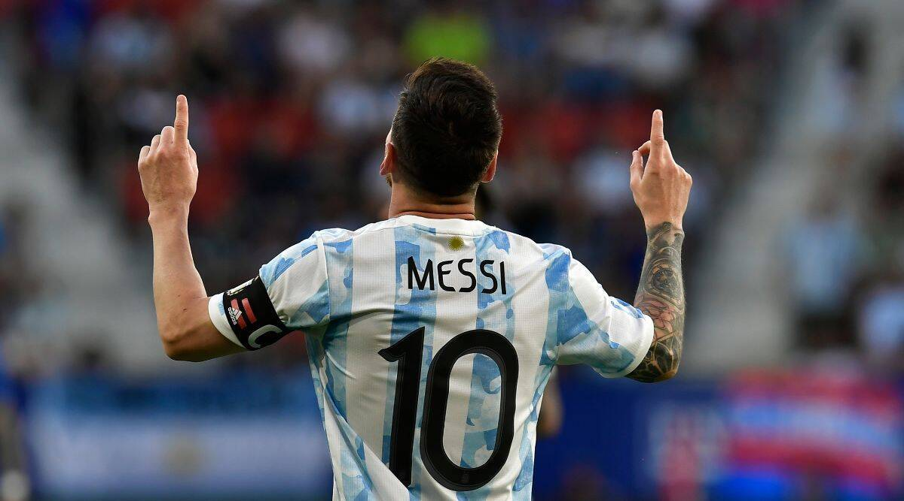
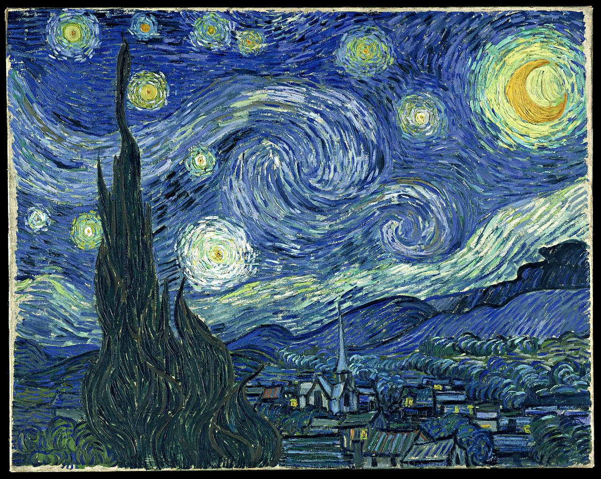

# Blend Style 

In this project, I used two different images with different texture and style to combine with each other with the help of style transfering algorithm.

## Language
The project is written in Python.

## Images
</img> 
</img> 

## Contributing
Pull requests are welcome. For major changes, please open an issue first to discuss what you would like to change.

Please make sure to update tests as appropriate.

## License
[ Apache-2.0 License](http://www.apache.org/licenses/)
